# sqld-lite-syntax

An IntelliJ IDEA plugin for SqlDelight `.sq` and `.sqm` files. It is a lightweight replacement for the
[SqlDelight IntelliJ plugin](https://github.com/sqldelight/sqldelight/tree/main/sqldelight-idea-plugin).

It does two things: syntax highlighting, and code navigation. Navigation runs between a `.sq` file
and Kotlin in both directions, and between the `.sq` and `.sqm` files that declare and use a table.
It generates no code; the SqlDelight Gradle plugin still does that.

## Features

- Highlighting for keywords, identifiers, literals, comments, punctuation, operators, query labels
  and bind arguments. Every colour has an entry on the Editor | Color Scheme | SqlDelight page.
- Go To Declaration from Kotlin to `.sq`: from a query call to its label, and from the name of a
  named argument to the bind argument it fills.
- Go To Declaration from `.sq` to Kotlin: from a label to the calls to that query, from a bind
  argument to the value each call passes for it, and from a Kotlin type name to the class it names.
- Find Usages on a query label, listing the Kotlin calls. Find Usages on generated Kotlin, listing
  the `.sq` it came from, alongside everything the Kotlin plugin already reports.
- Find Usages on a table or view, listing its whole history: the `CREATE`, every `ALTER` after it,
  and every statement that uses it. The same list comes back from any of those starting points, and
  Go To Declaration from a query reaches the `CREATE`.
- Cmd-hover and Quick Documentation on a name, saying what it declares: a query as the function a
  caller writes, a query label as the Kotlin that calls it, a bind argument, and a table, view or
  column as the statement that creates it.
- A Call Hierarchy for a query, showing the Kotlin functions that call it. It has its own tab in the
  Find Usages panel.
- A gutter icon on every label listing the same calls, with the count in its tooltip.
- An inspection that greys out a label no Kotlin code calls, with a quick fix that deletes it.

Navigation triggers on a call whose receiver name ends in `Queries`, so unrelated Kotlin is
untouched. Bind arguments map to parameters by position, because SqlDelight generates one parameter
per distinct named argument in first-mention order; a named Kotlin argument matches by name instead.
A query mixing in a positional `?` is skipped, because SqlDelight then names that parameter after
its column.

## Screenshots

Highlighting, and the Editor | Color Scheme | SqlDelight page that names every colour:

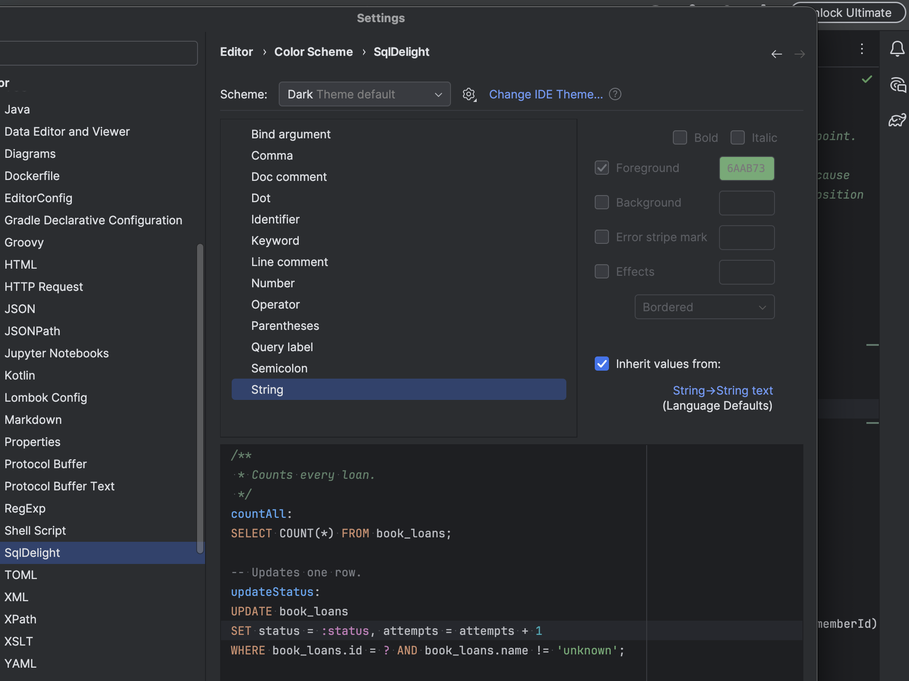

Cmd-hover on a query call in Kotlin names the query it runs, and the `.sq` file holding it:

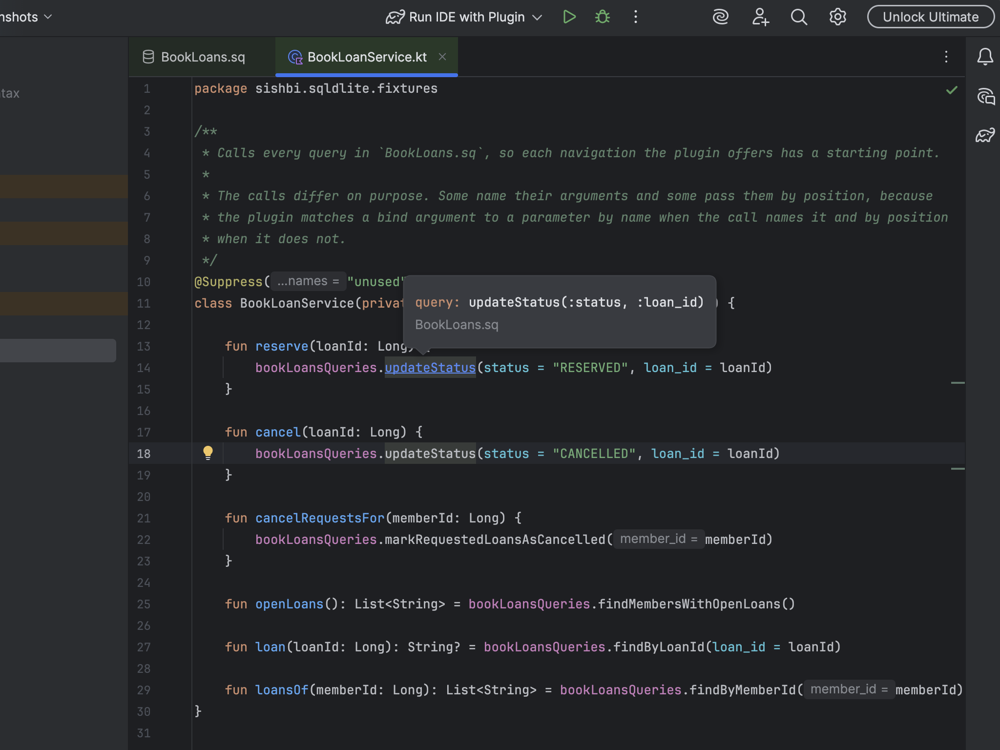

Cmd-hover on a query label names the Kotlin function that calls it, and the class that function
belongs to:

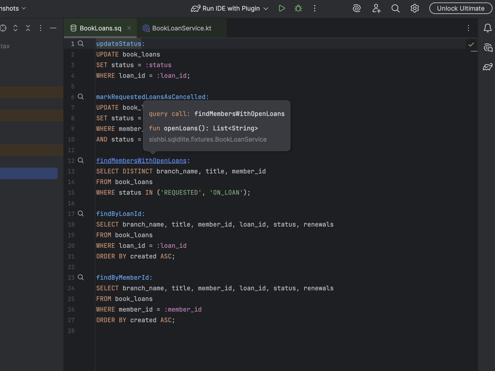

Cmd-hover on a table name shows the statement that creates it, and the migration it is in:

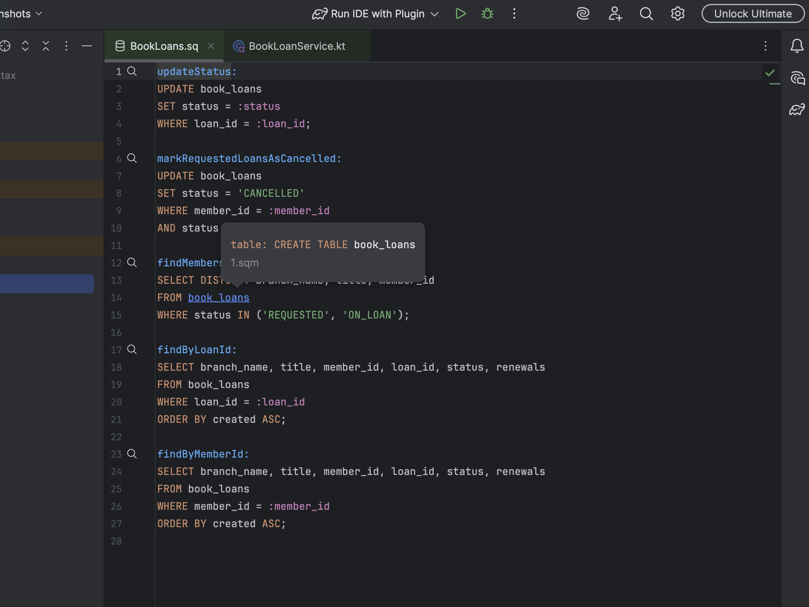

Cmd-hover on a column name shows its type, and the migration that declares it:

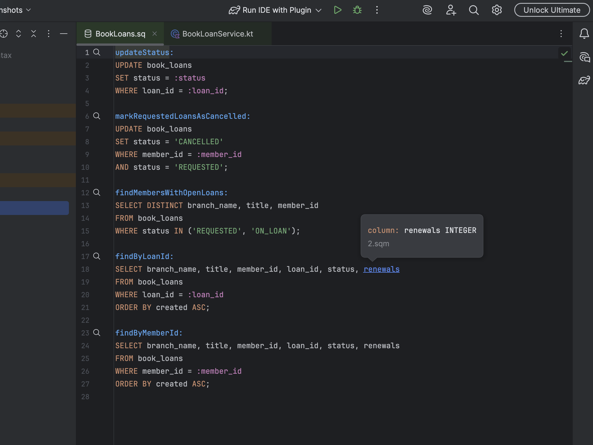

Quick Documentation on the same table name adds the `CREATE TABLE` statement itself, coloured as
the editor colours it:

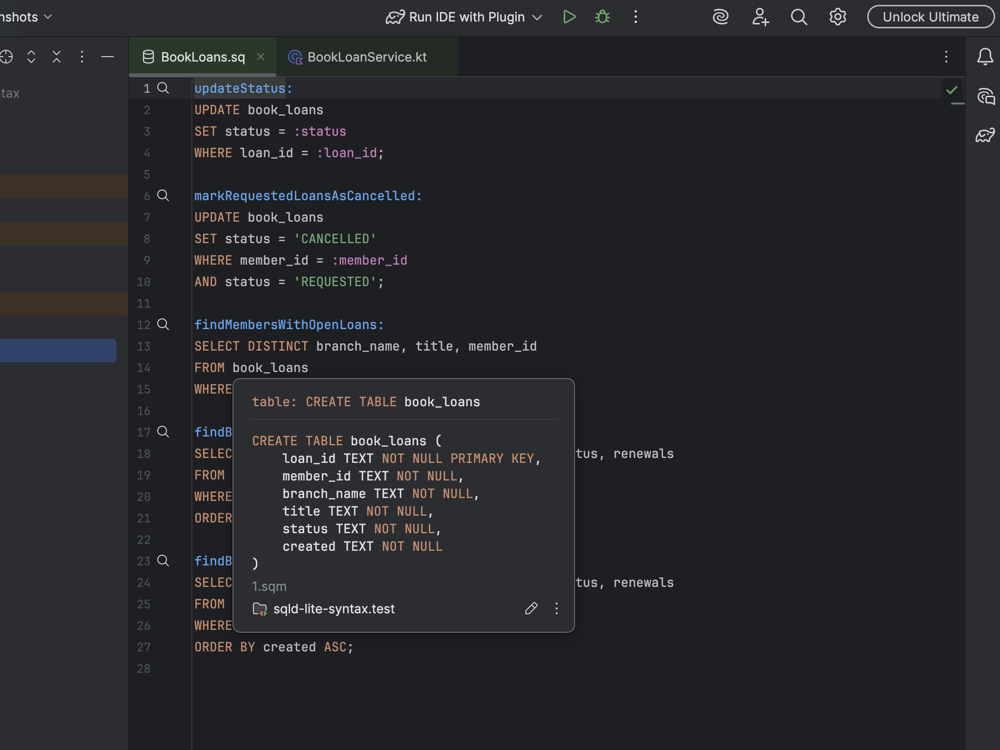

Quick Documentation on a column of a table the migrations only ever alter shows the `ALTER TABLE`
that adds it:

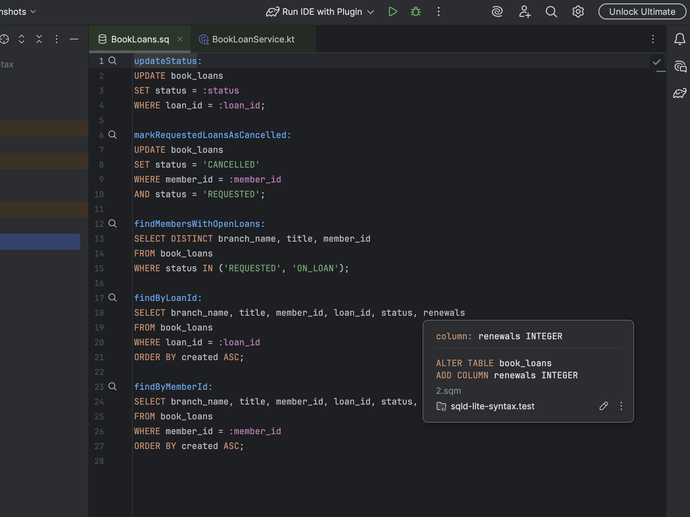

Go To Declaration from a label offers every call to that query, one row for each:

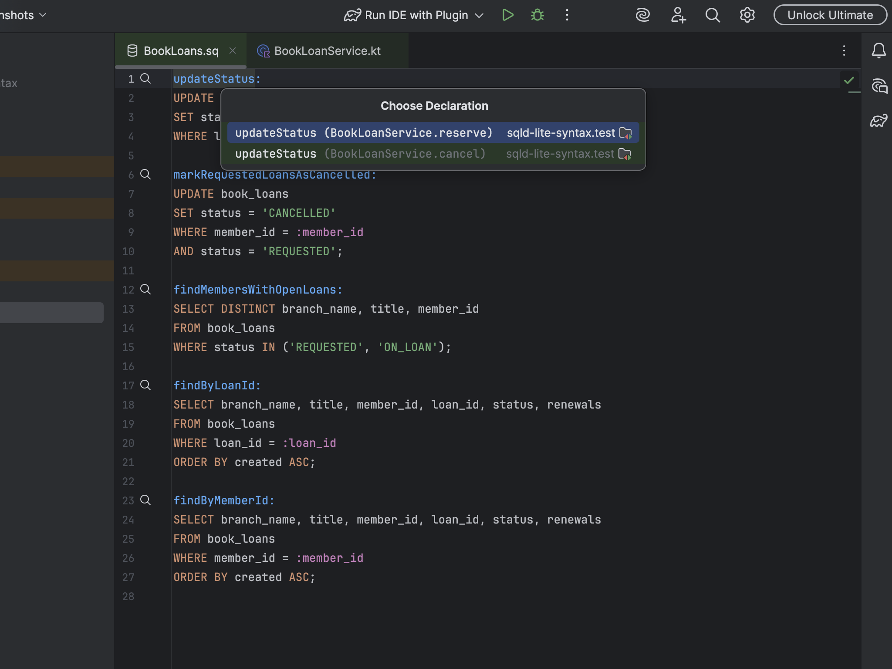

Find Usages on a query label lists the Kotlin calls under their own group, and the panel's Call
Hierarchy tab shows the query with the function that calls it beneath:

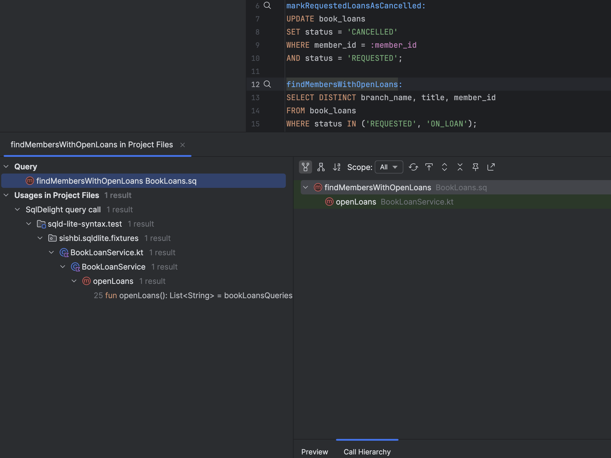

Find Usages on the generated Kotlin function reports the `.sq` query it came from, alongside
everything the Kotlin plugin already finds:

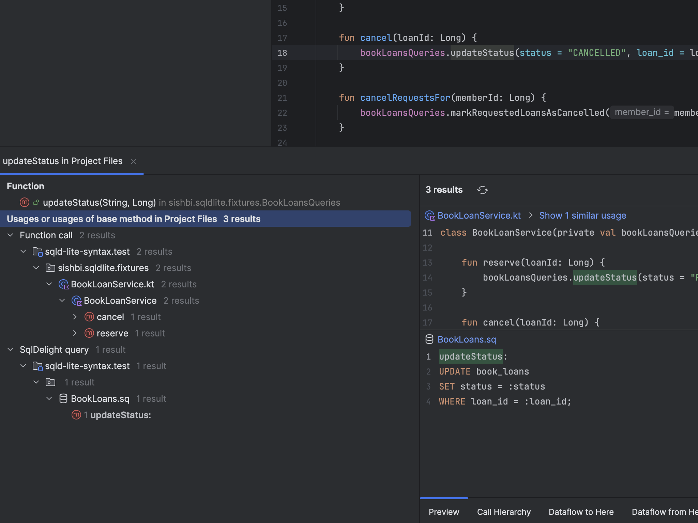

Find Usages on a table reports its whole history under named groups:

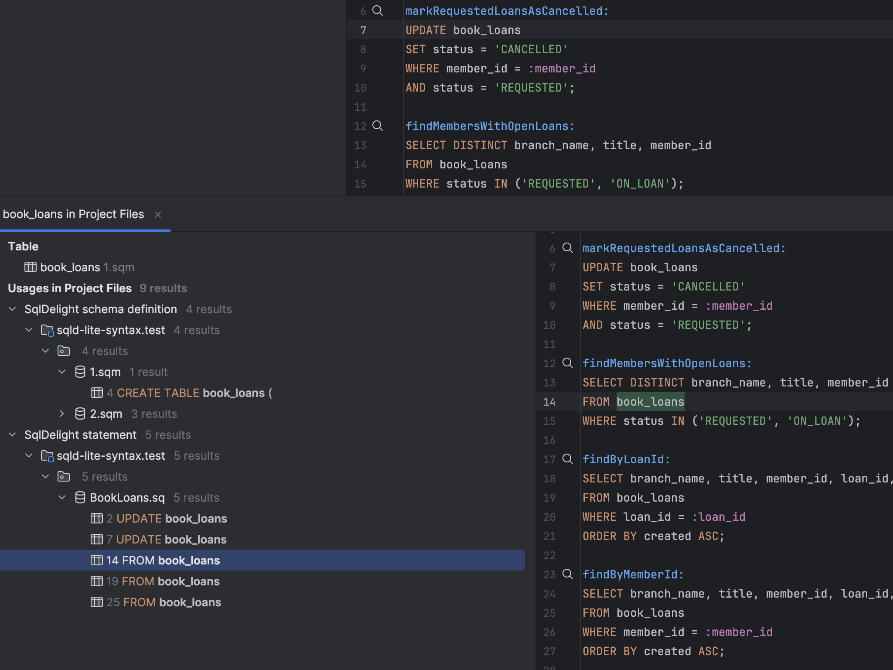

The gutter icon has its own entry under Settings | Editor | General | Gutter Icons:

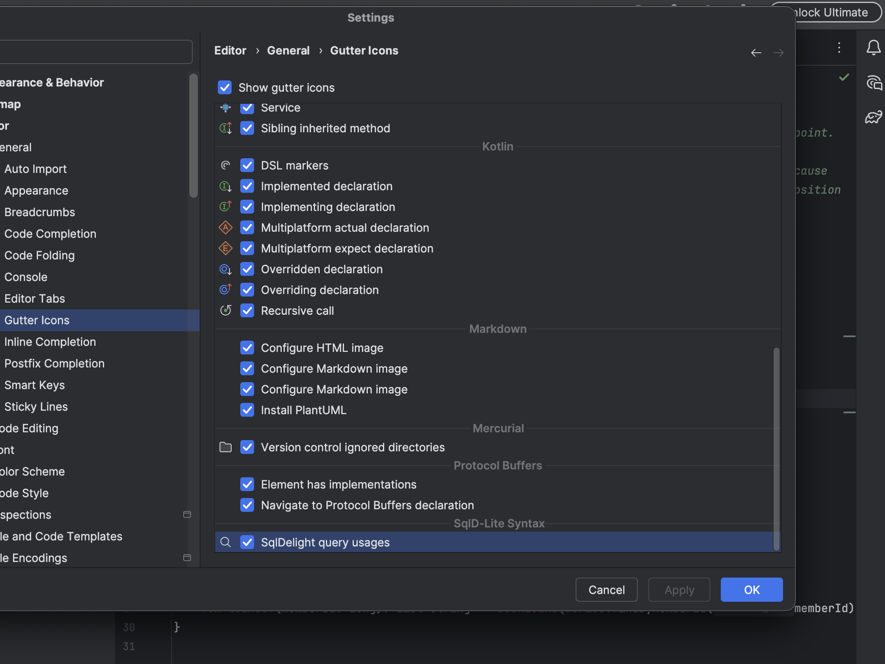

## Installing

From the IDE: Settings | Plugins | Marketplace, search for "SqlD-Lite Syntax".

From the web: the plugin page is
[SqlD-Lite Syntax](https://plugins.jetbrains.com/plugin/34288-sqld-lite-syntax), which also holds
every published version for a manual download and install from disk.

## Requirements

- IntelliJ IDEA 2026.2.2, build `IU-262.10315.125`.
- The PostgreSQL dialect of SqlDelight.
- The official SqlDelight plugin disabled. Both register a file type for `.sq`.

## The grammar

The `:sql-psi` subproject supplies the SQL lexer, parser and PSI, and covers core SQL only. It is
source in this repository, taken from a fork of
[sql-psi](https://github.com/sqldelight/sql-psi); `sql-psi/README.md` holds the provenance. An
overlay grammar, `SqldLite.bnf`, adds what SqlDelight and PostgreSQL add on top. It is not a full
PostgreSQL dialect: it covers the constructs a survey of real `.sq` and `.sqm` files found to be
needed, and every file in that survey parses with no error.

A construct the survey did not cover may still be unsupported, and a file using one is painted red.
Adding a rule is described in CLAUDE.md.

## Build

| Task | Purpose |
|---|---|
| `./gradlew test` | Unit tests. |
| `./gradlew verifyPlugin` | Plugin Verifier against the target build. Must report `Compatible`. |
| `./gradlew runIde` | Sandbox IDE with the plugin installed. |

## Licence

MIT, see [LICENSE](LICENSE). The distributed plugin also contains Apache-2.0 third-party code; see
[THIRD-PARTY.md](THIRD-PARTY.md).
